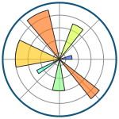

## I'm Fullstack Data Scientist

⚡ I'm **Md Nazmul**, aspiring Data Scientist with a strong academic background in Computer Science, eager to apply theoretical knowledge to real-world problems. Proficient in Python, R, and SQL, with hands-on experience in data analysis, machine learning, and data visualization through projects. Skilled in leveraging tools like Pandas, NumPy, Scikit-learn, and Tableau to extract insights and build predictive models. A quick learner with a passion for continuous improvement, committed to developing innovative solutions to complex challenges. Seeking an opportunity to contribute to data-driven decision-making and grow within a dynamic team.

## My Skill Set  
<table><tr><td valign="top" width="33%">

### Languages  

  
  
  
  
  
  
  

  

### Databases  

  
  
  
  
  
  
  

  

### Automation & Scripting  

  
  
  
  
  
  

  

### Version Control & Collaboration  

  
  
  
  

</td><td valign="top" width="33%">

### Data Analysis & Manipulation  

  
  
  
  
  
  
  

  

### Big Data & Distributed Computing  

  
  
  
  
  
  

  

### Deployment & DevOps  

  
  
  
  
  

  

</td><td valign="top" width="33%">

### Machine Learning  & Deep Learning  

  
  
  
  
  
  
  

  

### Data Visualization  

  
  
  
  
  
  

  

### Software Development Tools

  
  
  
  
  
  
  
  
  
  
  
  

</td></tr></table>  

   

## Connect with me  

  

  
  

   

## Github Stats  
  

 