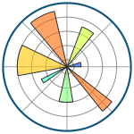
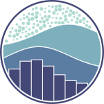
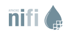
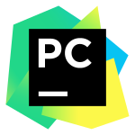
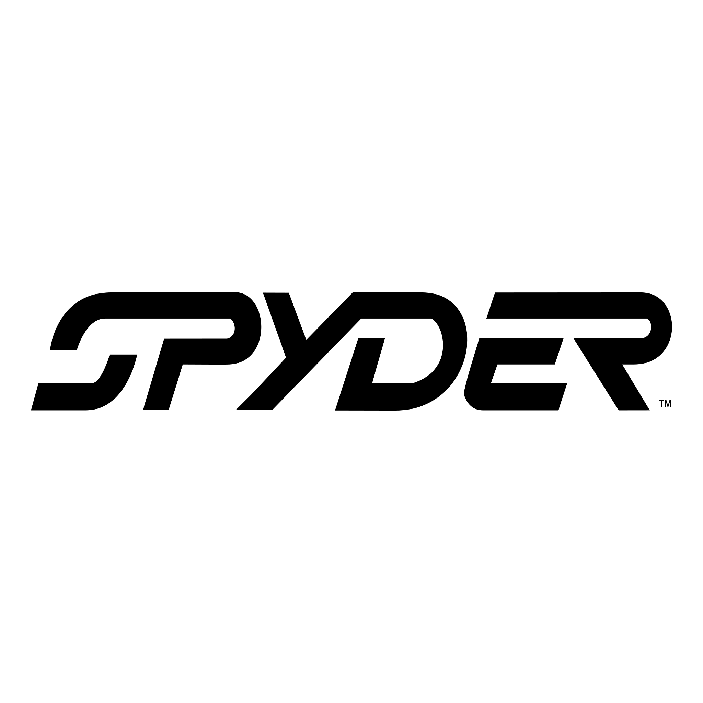

<p align="center">
  
  
  
  
</p>

<h1 align="center">Hi, I'm Md Nazmul Hasan Nihal 👋</h1>

<h3 align="center">Full-Stack Data Scientist | Machine Learning | Data Engineering</h3>

<p align="center">
  I turn complex data into reliable, explainable, and decision-ready systems.
</p>

---

## 🎯 Project Overview

I am a Computer Science-trained full-stack data scientist focused on building end-to-end data products that move from raw information to measurable business value. My work combines statistical analysis, machine learning, data engineering, and application development to create reproducible pipelines, production-minded models, and intuitive interfaces for real-world decision-making.

I am especially interested in solving problems where technical depth and practical impact meet: detecting risk, understanding behavior, automating workflows, and translating analytical results into clear actions for stakeholders.

### At a Glance

| Focus Area | What I Deliver | Core Tools |
|---|---|---|
| **Data Science & Machine Learning** | Exploratory analysis, predictive modeling, model evaluation, and interpretable insights | Python, R, SQL, pandas, scikit-learn, PyTorch, TensorFlow |
| **Data Engineering** | Scalable ingestion, streaming, transformation, and storage workflows | Spark, Kafka, Flink, Airflow, PostgreSQL, MongoDB |
| **Full-Stack Delivery** | APIs, dashboards, and maintainable applications that make models usable | FastAPI, Django, Flask, Docker, Kubernetes |
| **Analytics & Storytelling** | Clear visual narratives, KPI tracking, and decision-focused reporting | Excel, Power BI, Tableau, Plotly, Streamlit |

---

## ✨ Key Capabilities

- **End-to-end data products:** Move from data acquisition and cleaning to modeling, deployment, monitoring, and communication.
- **Machine learning & statistical modeling:** Build and evaluate supervised, unsupervised, and time-aware models with an emphasis on reproducibility and interpretability.
- **Real-time data engineering:** Design streaming architectures for high-volume event data using modern distributed systems.
- **Interactive analytics:** Create dashboards and visualizations that help technical and nontechnical teams act on evidence.
- **Production-minded engineering:** Use version control, containerization, automation, APIs, and clear documentation to make solutions maintainable.
- **Research-to-implementation:** Translate mathematical and scientific ideas into practical experiments, prototypes, and reusable software.

---

## 🚀 Featured Projects

| Project | Problem Solved | Technology Highlights |
|---|---|---|
| [**Intelligent-AML**](https://github.com/NazmulHasanNihal/Intelligent-AML) | Risk-controlled spatio-temporal graph learning for anti-money-laundering detection | Python, PyTorch, graph ML, FastAPI, React, Docker |
| [**q-grax-dti**](https://github.com/NazmulHasanNihal/q-grax-dti) | Quantum-inspired graph attention for drug–target interaction and affinity prediction | Python, graph neural networks, uncertainty calibration |
| [**OpsHub / Employee Management System**](https://github.com/NazmulHasanNihal/employee_management_system) | Scalable HR platform for employee lifecycle, attendance, payroll, and internal operations | Next.js, Go, PostgreSQL, Supabase, Redis |
| [**SmartStream**](https://github.com/NazmulHasanNihal/SmartStream-A-Real-Time-IoT-Data-Engineering-Pipeline) | Real-time IoT pipeline from sensor simulation to streaming analytics and live dashboards | Kafka, Flink, PostgreSQL, FastAPI, Streamlit, Docker |
| [**Fake News Detection**](https://github.com/NazmulHasanNihal/Fake-News-Detection-Naive-Bayes-and-LinearSVC-Approaches) | Interpretable text classification comparing TF-IDF, LinearSVC, and Naive Bayes approaches | Python, scikit-learn, TF-IDF, Jupyter |
| [**NoSQL Social Media Influence Analysis**](https://github.com/NazmulHasanNihal/NoSQL-Based-Real-Time-Social-Media-Engagement-Influence-Analysis) | NoSQL analytics for engagement, sentiment, hashtag behavior, and influence networks | MongoDB, Python, NLP, NetworkX, visualization |
| [**Marketing Campaign Performance Analysis**](https://github.com/NazmulHasanNihal/Marketing-Campaign-Performance-Analysis) | Multi-channel campaign evaluation using ROI, CPL, CAC, and audience-level KPIs | Excel, PivotTables, dashboards, business analytics |

> Explore the complete portfolio on [GitHub](https://github.com/NazmulHasanNihal?tab=repositories).

---

## 🧰 Technologies

### Languages & Querying

<div align="center">
  
  
  
  
  
  <strong>SQL</strong>
</div>

### Data Analysis, ML & Visualization

<div align="center">
  
  
  
  
  
  
  
  
  
  
  
  
  
  
  
  
</div>

### Data Platforms & Distributed Systems

<div align="center">
  
  
  
  
  
  
  
  
  
  
  
  
</div>

### Automation, Deployment & Collaboration

<div align="center">
  
  
  
  
  
  
  
  
  
  
  
  
  
</div>

### Development, Research & Communication

<div align="center">
  
  
  
  
  
  
  
  
  
  
  
  
  
  
  
</div>

---

## 🛠️ Installation & Setup

This repository is a **GitHub Profile README**, so it does not contain application code or require a runtime environment. No package installation or build step is needed.

### Prerequisites

- Git installed locally
- A GitHub account with access to this repository

### Clone the Repository

```bash
git clone https://github.com/NazmulHasanNihal/NazmulHasanNihal.git
cd NazmulHasanNihal
```

### Repository Details

| Item | Details |
|---|---|
| **Repository** | `NazmulHasanNihal/NazmulHasanNihal` |
| **Purpose** | GitHub profile README and supporting icon assets |
| **Default branch** | `main` |
| **Runtime** | None |
| **Build pipeline** | Not configured for this profile repository |
| **License** | Profile repository: unspecified |

---

## 🚀 Usage

The `README.md` file is rendered automatically on my GitHub profile because the repository name matches my GitHub username.

To update this profile:

1. Edit the relevant section in `README.md`.
2. Keep project links, skill names, and asset paths accurate.
3. Store supporting visuals in the `img/` directory.
4. Preview the Markdown before merging changes.
5. Commit and push the update to `main`.

Example project link format:

```markdown
[Project Name](https://github.com/NazmulHasanNihal/project-name)
```

This layout is designed to help recruiters, collaborators, and developers quickly understand my technical focus, review representative work, and navigate to detailed project repositories.

---

## 🤝 Contribution Guidelines

Contributions are welcome when they improve clarity, accuracy, accessibility, or the overall presentation of this profile.

1. **Fork the repository** and create a focused branch.
2. **Make scoped changes** to the README or supporting assets.
3. **Verify every link and image** renders correctly on GitHub.
4. **Keep the tone professional, inclusive, and technically accurate.**
5. **Do not add secrets, credentials, private data, or unrelated promotional content.**
6. **Open a pull request** with a concise summary of the proposed changes.

Suggested contributions include correcting outdated information, improving accessibility, refining project descriptions, and adding clearer navigation to representative work.

---

## 📁 Repository Contents

```text
NazmulHasanNihal/
├── README.md
└── img/
    └── Technology, tool, and platform icons
```

---

## 📬 Connect With Me

<p align="center">
  <a href="https://www.linkedin.com/in/nazmulhasannihal" target="_blank" rel="noopener noreferrer">
    
  </a>
  <a href="https://github.com/NazmulHasanNihal" target="_blank" rel="noopener noreferrer">
    
  </a>
  <a href="https://gitlab.com/NazmulHasanNihal" target="_blank" rel="noopener noreferrer">
    
  </a>
  <a href="https://www.kaggle.com/nazmulhasannihal" target="_blank" rel="noopener noreferrer">
    
  </a>
  <a href="https://twitter.com/nazmulhas363" target="_blank" rel="noopener noreferrer">
    
  </a>
  <a href="https://www.facebook.com/8lack.rabbit" target="_blank" rel="noopener noreferrer">
    
  </a>
</p>

---

## 📊 GitHub Stats

<div align="center">
  
  
</div>

<p align="center">
  <em>Built with a focus on clarity, reproducibility, and measurable impact.</em>
</p>
