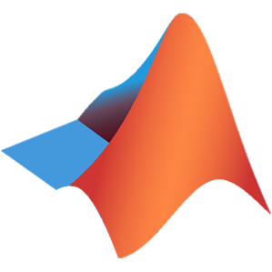
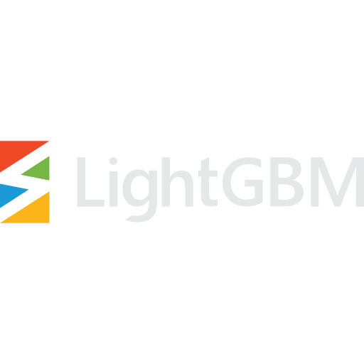
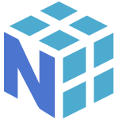
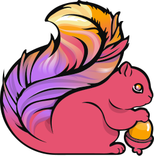

  

<h1 align="center">Md Nazmul Hasan Nihal</h1>

<h3 align="center">Full-Stack Data Scientist | Machine Learning | Data Engineering</h3>

  I turn complex data into reliable, explainable, and decision-ready systems.

  
  
  

---

## Live GitHub Dashboard

<table>
  <tr>
    <td width="50%" align="center">
      
    </td>
    <td width="50%" align="center">
      
    </td>
  </tr>
  <tr>
    <td width="50%" align="center">
      
    </td>
    <td width="50%" align="center">
      
    </td>
  </tr>
</table>

---

## Technical Focus

<table>
  <tr>
    <td align="center" width="33%" valign="top">
      <b>Data Science & Machine Learning</b>  
      Exploratory analysis, predictive modeling, model evaluation, and interpretable insights built for reproducibility and production.
    </td>
    <td align="center" width="33%" valign="top">
      <b>Data Engineering</b>  
      Scalable ingestion, streaming, transformation, and storage workflows using modern distributed systems and orchestration.
    </td>
    <td align="center" width="33%" valign="top">
      <b>Full-Stack Delivery</b>  
      APIs, dashboards, and maintainable applications that make models usable by technical and nontechnical stakeholders.
    </td>
  </tr>
</table>

---

## Featured Work

<table>
  <tr>
    <td align="center" width="25%" valign="top">
      <a href="https://github.com/NazmulHasanNihal/Intelligent-AML" target="_blank" rel="noopener noreferrer"><b>Intelligent-AML</b></a> 
      Risk-controlled spatio-temporal graph learning for anti-money-laundering detection  
      
      
       
      
      
    </td>
    <td align="center" width="25%" valign="top">
      <a href="https://github.com/NazmulHasanNihal/q-grax-dti" target="_blank" rel="noopener noreferrer"><b>q-grax-dti</b></a> 
      Quantum-inspired graph attention for drug–target interaction and affinity prediction  
      
      
       
      
      
    </td>
    <td align="center" width="25%" valign="top">
      <a href="https://github.com/NazmulHasanNihal/SmartStream-A-Real-Time-IoT-Data-Engineering-Pipeline" target="_blank" rel="noopener noreferrer"><b>SmartStream</b></a> 
      Real-time IoT pipeline from sensor simulation to streaming analytics and live dashboards  
      
      
       
      
      
    </td>
    <td align="center" width="25%" valign="top">
      <a href="https://github.com/NazmulHasanNihal/employee_management_system" target="_blank" rel="noopener noreferrer"><b>Employee Management System</b></a> 
      Scalable HR platform for employee lifecycle, attendance, payroll, and internal operations  
      
      
       
      
      
    </td>
  </tr>
</table>

### More Repositories

- [**Fake News Detection**](https://github.com/NazmulHasanNihal/Fake-News-Detection-Naive-Bayes-and-LinearSVC-Approaches) — Interpretable text classification with TF-IDF, LinearSVC, and Naive Bayes
- [**NoSQL Social Media Influence Analysis**](https://github.com/NazmulHasanNihal/NoSQL-Based-Real-Time-Social-Media-Engagement-Influence-Analysis) — Engagement, sentiment, and influence network analytics
- [**Marketing Campaign Performance Analysis**](https://github.com/NazmulHasanNihal/Marketing-Campaign-Performance-Analysis) — Multi-channel ROI, CPL, CAC, and KPI evaluation

---

## Technical Toolkit

### Languages & Querying

  
  
  
  
  
  <strong>SQL</strong>

### ML & Analytics

  
  
  
  
  
  
  
  
  

### Data Platforms & Streaming

  
  
  
  
  
  
  
  

### Engineering & Delivery

  
  
  
  
  
  
  
  
  
  

---

## Delivery Approach

  <b>Ingest</b> &nbsp;→&nbsp; <b>Model</b> &nbsp;→&nbsp; <b>Deploy</b> &nbsp;→&nbsp; <b>Communicate</b>

---

## Connect

  
  
  
  
  
  

